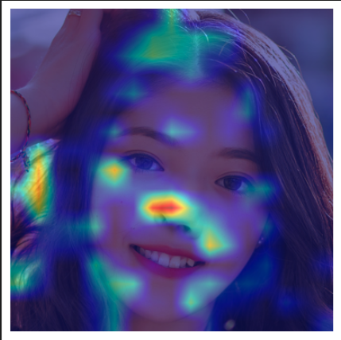

# Fake Face Detection

## Problem statement

Using AI to create fakes are becoming increasingly prevalent, this includes generating convincing images, videos or audio clips. This offers a variety of opportunities such as content creation for entertainment and marketing. Other benefits include immersive storytelling by recreating timelines with AI-generated historical figures.

However, this also poses a new form of danger as these fakes can be used to spread misinformation through false advertisements by mimicking brand ambassadors. Worse, politicians may be impersonated to sway public opinions, sowing discord, manipulating the public and destroying their reputations.

## Project Description

The aim of the project is to implement an AI solution to detect the presence of fake faces that have been tampered with. The end product allows a user to upload an image and the model classifies if the uploaded image is real or fake.

## Dataset

A Kaggle dataset consisting of real and fake face images is used for this problem statement:

* [Dataset](https://www.kaggle.com/datasets/ciplab/real-and-fake-face-detection?rvi=1)

Summary from EDA:

* The dataset consists of 2 classes: Real (1081 instances) and Fake (960 instances)
* All the images are colored (RGB mode) and are of size (600, 600)
* The fake images are further classified into Easy (240 instances), Medium (480 instances) and Hard (240 instances)

## Model Training

For the model architecture, a Facenet was used as the model backbone, which is essentially an Inception ResNet that has been pretrained on facial data. A simple neural network binary classifier head is attached this pretrained model and is fine tuned on the Kaggle dataset.

## Inference Pipeline

A Flask application is deployed as a front end to host the model. Users will be able to upload an image and the model runs predictions in the back end to return a classification if the image is real or fake.

## Explainability AI

In an attempt to explain what the model "sees" before making a classification, GradCAM is used to overlay a heatmap to show which parts of the image that impact the classification the most. This is done by analysising the gradients of the final output layer of the model, just before the classification head.

GradCAM overlay results:

## Authors

Author | Email
-- | --
Albert (Dale) | albert_peh_lh@aiap.sg
Clement | clement_ong_sq@aiap.sg
Zheng Xuan | lim_zheng_xuan@aiap.sg